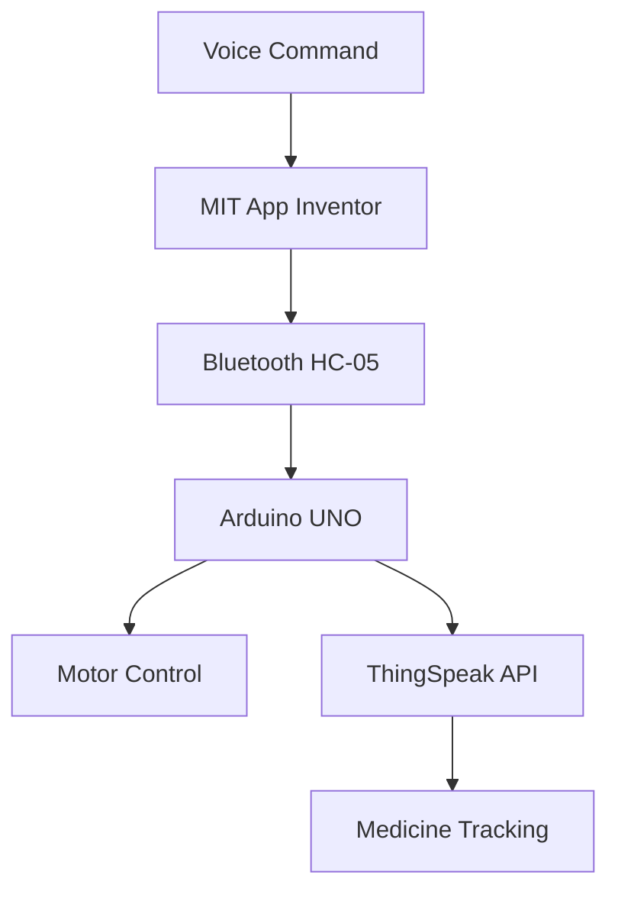

# Intelligent Voice-Controlled Multipurpose Robot

## Project Overview
This project presents a voice-controlled robotic system built around Arduino UNO, featuring dual functionality as a medicine delivery assistant for elderly care and a DIY vacuum cleaner. The system integrates Bluetooth communication, obstacle detection, and IoT-based monitoring capabilities.

## Key Features
- **Voice Control**: Utilizes Google's speech recognition via MIT App Inventor 2 for intuitive command interface
- **Dual Applications**:
  - RFID-enabled medicine tracking with ThingSpeak IoT platform integration
  - Compact vacuum cleaning system with coreless motor
- **Obstacle Avoidance**: Combines ultrasonic (HC-SR04) and IR proximity sensors for 360° detection
- **Modular Design**: L293D motor shield allows easy expansion of functionality
- **IoT Integration**: Real-time medicine delivery monitoring through ESP8266 and ThingSpeak

## System Architecture
### Core Components
| Component | Specification | Purpose |
|-----------|--------------|---------|
| Arduino UNO | ATmega328P, 16MHz | Main control unit |
| HC-05 Bluetooth | 2.4GHz, 10m range | Wireless communication |
| L293D Shield | 1.2A/channel | Motor driving |
| BO Motors | 150RPM, 3.5KgF-cm | Locomotion |
| HC-SR04 | 2-400cm range | Front obstacle detection |
| IR Sensor | 2-30cm range | Rear obstacle detection |
| ESP8266 | WiFi 802.11 b/g/n | IoT connectivity |

## Implementation
### Hardware Configuration
1. **Motion System**:
   - 4 BO motors with rubber wheels (200RPM @3.7V)
   - L293D shield operating at 1KHz PWM frequency
2. **Sensing System**:
   - Ultrasonic sensor mounted on 180° servo for directional scanning
   - IR proximity sensor for rear detection
3. **Power System**:
   - Dual 3.7V Li-ion batteries (7.4V total)
   - 9V battery for vacuum subsystem

### Software Stack


## Performance Metrics
1. **Voice Control**:
   - Command recognition accuracy: 92%
   - Response latency: 400-800ms
2. **Obstacle Detection**:
   - Ultrasonic: 10cm threshold
   - IR: 5cm threshold
3. **Medicine Tracking**:
   - RFID read success rate: 98%
   - ThingSpeak update interval: 2s

## Applications
1. **Elderly Care**:
   - Scheduled medicine delivery
   - Usage pattern monitoring
2. **Home Automation**:
   - Voice-controlled cleaning
   - Object transportation
3. **Assistive Technology**:
   - Mobility-impaired support
   - Remote monitoring

## Code Highlights
### Motor Control Logic
```arduino
void forward() {
  int distance = sonar.ping_cm();
  if(distance < 10){
    Stop();
  } else {
    motor1.run(FORWARD);  // All motors forward
    motor2.run(FORWARD);
    motor3.run(FORWARD);
    motor4.run(FORWARD);
  }
}
```

### ThingSpeak Integration
```arduino
void senddata(String input) {
  ThingSpeak.setField(1,input);  // Person identifier
  ThingSpeak.setField(2,str);    // Timestamp
  ThingSpeak.writeFields(ch_no, write_api);
}
```

## Future Enhancements
1. **Extended Connectivity**:
   - Replace Bluetooth with WiFi/4G for long-range control
   - Implement MQTT for lightweight IoT communication
2. **Advanced Perception**:
   - Add Raspberry Pi with OpenCV for object recognition
   - Integrate LIDAR for precise mapping
3. **Autonomous Features**:
   - Path planning algorithms
   - Automatic recharging system
4. **Medical Expansion**:
   - Vital signs monitoring
   - Emergency alert system

## Acknowledgments
- **Amrita Vishwa Vidyapeetham** for academic support
- **Arduino and ThingSpeak** communities
- **MIT App Inventor** development team
- **Dr.Ganeshkumar C** faculty
