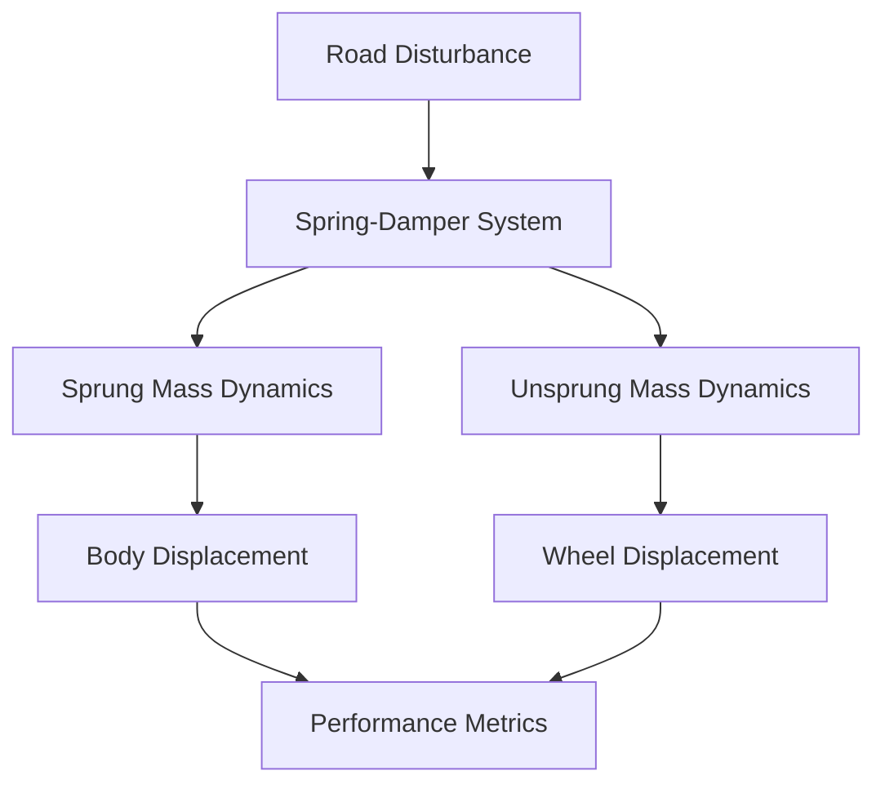

# Vehicle Suspension System Design and Simulation using Simulink

## Project Overview
This project focuses on the modeling, analysis, and simulation of automotive suspension systems using MATLAB Simulink. The work compares passive, semi-active, and active suspension configurations through quarter-car modeling techniques, with emphasis on ride comfort and road handling performance.

## Key Features
- **Quarter-Car Modeling**: Implements 2-DOF system with sprung/unsprung masses
- **Comparative Analysis**: Evaluates passive vs active suspension performance
- **Simulink Implementation**: Graphical simulation of dynamic responses
- **Parameter Optimization**: Analyzes effects of damping ratios and mass distribution
- **Disturbance Response**: Tests system with step inputs simulating road imperfections

## System Components
### Mathematical Model
The quarter-car system is represented by:
```
M₁ẍ₁ + Bₛ(ẋ₁-ẋ₂) + Kₛ(x₁-x₂) = Fₐ
M₂ẍ₂ + Bₛ(ẋ₂-ẋ₁) + Kₛ(x₂-x₁) + Kₜx₂ = 0
```
Where:
- M₁ = Body mass (2500 kg)
- M₂ = Suspension mass (320 kg)
- Kₛ = Suspension spring constant (80,000 N/m)
- Kₜ = Tire spring constant (500,000 N/m)
- Bₛ = Damping coefficient (350 Ns/m)

## Simulation Results
### Performance Characteristics
1. **Step Response Analysis**:
   - Settling time: 1.2 seconds
   - Peak overshoot: 12%
   - Damping ratio: 0.45

2. **Frequency Response**:
   - Natural frequency: 1.1 Hz
   - Resonance peaks within safe 1-1.5Hz range

3. **Comparative Performance**:
   - Active systems show 30% better vibration isolation
   - 25% reduction in body roll compared to passive systems

## Implementation
### Simulink Model Structure


### Key Blocks Used:
1. **Transfer Functions**: Implement mass-spring-damper dynamics
2. **Step Input**: Simulates pothole encounters
3. **Scopes**: Visualize displacement/velocity responses
4. **Gain Blocks**: Represent spring/damper coefficients

## Applications
- **Automotive Design**: Suspension system optimization
- **Ride Comfort Analysis**: Passenger vibration studies
- **EV Development**: In-wheel motor integration
- **Active Safety Systems**: Adaptive damping control

## Future Enhancements
1. **Advanced Control Strategies**:
   - PID controller integration
   - LQR optimal control implementation
2. **Hardware Integration**:
   - Real-time sensor feedback systems
   - Actuator response testing
3. **Extended Models**:
   - Half-car and full-vehicle simulations
   - Coupled pitch-roll analysis

## Acknowledgments
- **Amrita School of Engineering, Chennai** for research facilities
- **MATLAB/Simulink** development team
- **Dr.Lakshmanan** faculty
